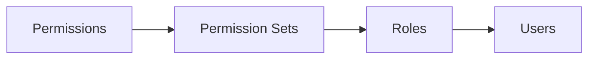

Support Bot uses a hierarchical permission system based on roles and permission sets. This allows flexible, fine-grained access control across your organization.

## Permission Hierarchy

The system uses a three-level hierarchy:

<Steps>
  <Step title="Permissions">
    Individual capabilities like `user.edit` or `role.create`. These are system-defined and cannot be modified.
  </Step>
  
  <Step title="Permission Sets">
    Groups of related permissions (e.g., "User Management" includes `user.view`, `user.edit`, `user.delete`).
  </Step>
  
  <Step title="Roles">
    Collections of permission sets assigned to users (e.g., "Admin" role includes multiple permission sets).
  </Step>
  
  <Step title="Users">
    Have one or more roles, which grant them all permissions from those roles' permission sets.
  </Step>
</Steps>

## System Permissions

All permissions are organized into categories:

### User Management
- `user.view` - View user list and details
- `user.edit` - Modify user roles and permissions
- `user.delete` - Remove users from the system

### Role Management
- `role.view` - View roles and their permission sets
- `role.create` - Create new roles
- `role.edit` - Modify existing roles
- `role.delete` - Remove roles

### Permission Set Management
- `permission_set.view` - View permission sets
- `permission_set.create` - Create custom permission sets
- `permission_set.edit` - Modify permission sets
- `permission_set.delete` - Remove permission sets

### AI/ML Configuration
- `aiml.view` - View AI/ML settings
- `aiml.edit` - Modify model selection, temperature, and safety settings

### LLM Provider Management
- `llm_provider.view` - View LLM provider configurations
- `llm_provider.create` - Add new LLM providers
- `llm_provider.edit` - Update provider settings
- `llm_provider.delete` - Remove providers
- `llm_provider.test` - Test provider connections

### Integration Management
- `integration.view` - View integrations
- `integration.create` - Add new integrations
- `integration.edit` - Modify integration settings
- `integration.delete` - Remove integrations
- `integration.sync` - Trigger manual sync operations

### Settings Management
- `auth.view` - View authentication settings
- `auth.edit` - Modify authentication providers
- `history.view` - View configuration history
- `history.rollback` - Rollback to previous configurations

<Info>
  Permissions are read-only and cannot be created or modified. They're defined by the system.
</Info>

## Managing Roles

### View All Roles

Navigate to **Settings** > **Roles & Permissions** to see all configured roles. The table shows:

- Role name
- Description
- Permission sets included in the role
- Actions (Edit, Delete)

### Create a New Role

<Steps>
  <Step title="Open Create Dialog">
    Click the **Add Role** button in the top-right corner.
  </Step>
  
  <Step title="Enter Role Details">
    Provide:
    - **Name** (required) - A descriptive name like "Report Manager"
    - **Description** (optional) - What this role is for
  </Step>
  
  <Step title="Select Permission Sets">
    Check the permission sets this role should include. Each permission set shows:
    - Name and description
    - Preview of included permissions (first 3)
    
    <Warning>
      At least one permission set is required.
    </Warning>
  </Step>
  
  <Step title="Save">
    Click **Create** to save the new role.
  </Step>
</Steps>

### Edit Existing Role

<Steps>
  <Step title="Click Edit">
    In the roles table, click **Edit** next to the role you want to modify.
  </Step>
  
  <Step title="Update Details">
    Change the name, description, or permission set assignments.
  </Step>
  
  <Step title="Save Changes">
    Click **Save Changes** to apply your updates.
  </Step>
</Steps>

<Note>
  Changes to roles take effect immediately for all users with that role.
</Note>

### Delete a Role

<Steps>
  <Step title="Click Delete">
    In the roles table, click **Delete** next to the role.
  </Step>
  
  <Step title="Confirm Deletion">
    A confirmation dialog will warn you that users with this role will lose its permissions.
  </Step>
  
  <Step title="Confirm">
    Click **Delete** to remove the role permanently.
  </Step>
</Steps>

<Warning>
  Deleting a role removes those permissions from all assigned users immediately. This action cannot be undone.
</Warning>

## Managing Permission Sets

Permission sets group related permissions together for easier management.

### View Permission Sets

From **Settings** > **Permission Sets**, you can see all available permission sets with their included permissions.

### Create Custom Permission Set

<Steps>
  <Step title="Navigate to Permission Sets">
    Go to **Settings** > **Permission Sets** and click **Create Permission Set**.
  </Step>
  
  <Step title="Enter Details">
    Provide:
    - **Code** (required) - A unique identifier like `custom_analysts`
    - **Name** (required) - Display name like "Custom Analysts"
    - **Description** (optional) - What this set is for
  </Step>
  
  <Step title="Select Permissions">
    Choose individual permissions to include in this set. Permissions are grouped by category for easier browsing.
  </Step>
  
  <Step title="Save">
    Click **Create** to save the permission set.
  </Step>
</Steps>

### Edit Permission Set

You can update the name, description, and included permissions of any custom permission set.

<Note>
  System-defined permission sets (like those created during installation) can be viewed but not modified.
</Note>

### Delete Permission Set

<Warning>
  Deleting a permission set removes it from all roles that include it. Users will lose those permissions immediately.
</Warning>

## Role Assignment Workflow

When assigning permissions to users:

<Steps>
  <Step title="Identify Required Permissions">
    Determine what the user needs to do (e.g., manage integrations, configure AI).
  </Step>
  
  <Step title="Find or Create Appropriate Role">
    Check if an existing role provides those permissions. If not, create a new role with the needed permission sets.
  </Step>
  
  <Step title="Assign Role to User">
    From **User Management**, edit the user and assign the role.
  </Step>
  
  <Step title="Verify Access">
    Have the user refresh their session or log out and back in to receive the new permissions.
  </Step>
</Steps>

## Required Permissions

| Action | Permission Required |
|--------|--------------------|
| View roles | `role.view` |
| Create roles | `role.create` + `permission_set.view` |
| Edit roles | `role.edit` + `permission_set.view` |
| Delete roles | `role.delete` |
| View permission sets | `permission_set.view` |
| Create permission sets | `permission_set.create` |
| Edit permission sets | `permission_set.edit` |
| Delete permission sets | `permission_set.delete` |

<Info>
  The UI automatically hides actions you don't have permission to perform.
</Info>

## Best Practices

<CardGroup cols={2}>
  <Card title="Role-Based Design" icon="sitemap">
    Design roles around job functions (Admin, Analyst, Viewer) rather than individuals.
  </Card>
  
  <Card title="Minimal Permission Sets" icon="minimize">
    Keep permission sets focused on specific features or workflows.
  </Card>
  
  <Card title="Test Before Deploy" icon="vial">
    Create test roles and verify they grant the expected access before assigning to users.
  </Card>
  
  <Card title="Document Roles" icon="file-lines">
    Use the description field to document what each role is intended for.
  </Card>
</CardGroup>

## Common Role Examples

### Administrator
Full system access with all permission sets:
- User Management
- Role Management
- Integration Management
- AI/ML Configuration
- Settings Management

### Integration Manager
Manage data sources without system access:
- `integration.view`
- `integration.create`
- `integration.edit`
- `integration.sync`

### AI Configurator
Manage AI settings without user management:
- `aiml.view`
- `aiml.edit`
- `llm_provider.view`
- `llm_provider.edit`
- `llm_provider.test`

### Read-Only Auditor
View-only access to all settings:
- `user.view`
- `role.view`
- `permission_set.view`
- `integration.view`
- `aiml.view`
- `history.view`

## API Reference

For programmatic access, see:
- [Roles API](/api/admin/roles)
- [Permissions API](/api/admin/permissions)
- [Permission Sets API](/api/admin/permissions)