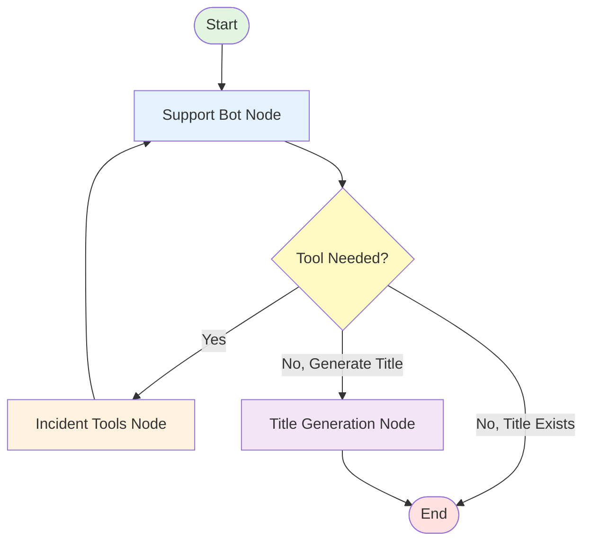
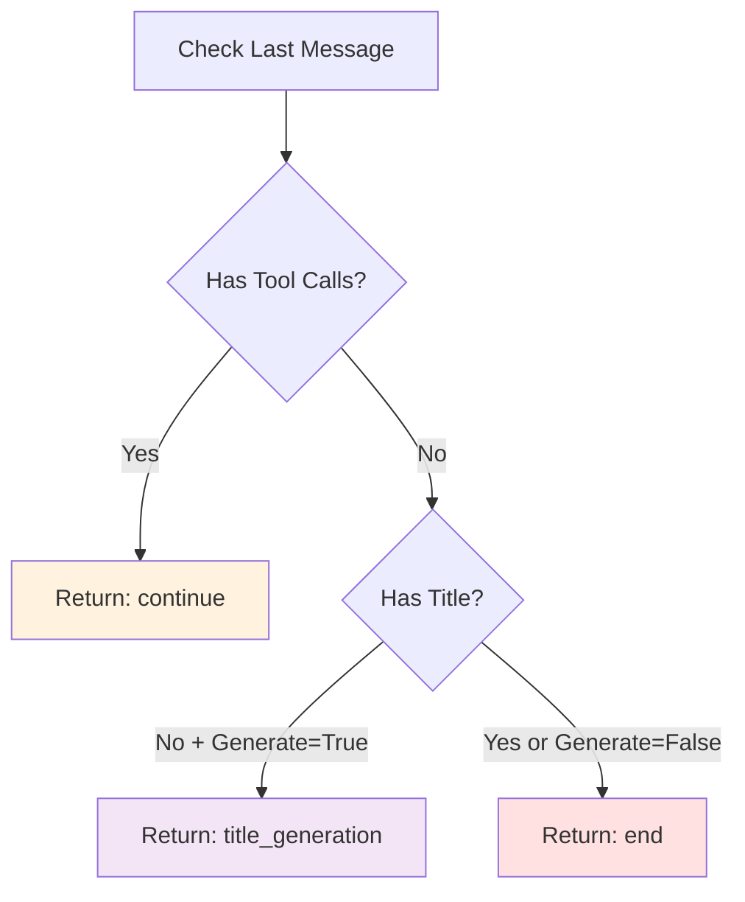

## Overview

The agent is built using **LangGraph**, a framework for creating stateful, multi-actor applications with LLMs. The architecture is based on a state graph that routes execution through different nodes based on conditional logic.

## State Graph Structure

### Visual Representation



The graph consists of:

- **3 Nodes**: Processing units that execute specific functions
- **2 Edge Types**: Conditional edges (decision-based) and direct edges (automatic)
- **1 Entry Point**: All conversations start at the `support_bot` node
- **1 End State**: Conversations conclude when no more tools are needed

## State Schema

The agent state is defined using a TypedDict in `src/copilot/graph.py:74`:

```python
class AgentState(TypedDict):
    """State schema for the agent graph."""
    messages: Annotated[Sequence[BaseMessage], add_messages]
    title: Optional[str]
    session_id: Optional[str]
    user_id: Optional[str]
    langfuse_enabled: Optional[bool]
    generate_title: Optional[bool]
```

### State Fields

<ParamField path="messages" type="Sequence[BaseMessage]" required>
  Conversation history with special `add_messages` reducer that intelligently merges new messages
</ParamField>

<ParamField path="title" type="str">
  Generated conversation title (2-4 words summarizing the conversation)
</ParamField>

<ParamField path="session_id" type="str">
  Unique identifier for the conversation thread (used for checkpointing)
</ParamField>

<ParamField path="user_id" type="str">
  User identifier for tracing and observability
</ParamField>

<ParamField path="langfuse_enabled" type="bool">
  Flag to enable Langfuse tracing (default: False for privacy)
</ParamField>

<ParamField path="generate_title" type="bool">
  Whether to generate a title in the graph (default: True)
</ParamField>

### State Reducers

The `add_messages` reducer is crucial for state management:

```python
messages: Annotated[Sequence[BaseMessage], add_messages]
```

This annotation tells LangGraph to:
- **Append** new messages to the existing list
- **Update** messages with matching IDs
- **Preserve** conversation history across nodes

## Node Functions

Each node is a Python function that takes the current state and returns a partial state update.

### 1. Support Bot Node (`call_model`)

**Location**: `src/copilot/graph.py:210`

**Purpose**: Invokes the LLM with tool bindings to generate responses or tool calls

**Process**:

1. **Extract User Query**: Gets the latest user message from state
2. **Search Golden Examples**: Finds similar past conversations for context
3. **Enhance System Prompt**: Injects golden examples into the system message
4. **Bind Tools**: Attaches available tools to the LLM
5. **Invoke LLM**: Calls the model with enhanced prompt and conversation history
6. **Return Response**: Adds LLM response (text or tool calls) to state

```python
def call_model(state: AgentState) -> dict:
    # Get configured LLM with tools bound
    model_with_tools = _get_model_with_tools()
    
    # Search for golden examples
    golden_examples = search_golden_examples_sync(query=latest_query)
    
    # Enhance system prompt
    enhanced_prompt = build_prompt_with_golden_examples()
    
    # Invoke LLM
    response = model_with_tools.invoke(messages)
    
    return {"messages": [response]}
```

**System Prompt Highlights** (`src/copilot/graph.py:156`):

- Prioritizes verified knowledge from golden examples
- Provides tool selection guidance
- Enforces query rewriting for tools
- Sets citation and formatting rules

### 2. Incident Tools Node (`tool_wrapper`)

**Location**: `src/copilot/graph.py:266`

**Purpose**: Executes tool calls requested by the LLM

**Process**:

1. **Extract Tool Calls**: Gets tool name and arguments from LLM response
2. **Execute Tools**: Runs the appropriate tool function
3. **Stream Status**: Updates UI with search progress
4. **Return Results**: Adds tool results to message history

```python
def tool_wrapper(state: AgentState) -> dict:
    callbacks = _get_callbacks(state)
    return _qdrant_tool_node.invoke(state, config={"callbacks": callbacks})
```

**Available Tools** (`src/copilot/tools/__init__.py:14`):

- `lookup_incident_by_id`: Direct ID-based lookup
- `search_similar_incidents`: Semantic similarity search
- `get_incidents_by_application`: Application-filtered search
- `get_recent_incidents`: Time-based filtering

### 3. Title Generation Node (`title_generation_node`)

**Location**: `src/copilot/graph.py:316`

**Purpose**: Generates a concise title for the conversation

**Process**:

1. **Extract Conversation**: Collects all messages from state
2. **Create Summary Prompt**: Instructs LLM to generate 2-4 word title
3. **Invoke LLM**: Calls model without tools
4. **Update State**: Adds title to state and streams to UI

```python
def title_generation_node(state: AgentState) -> dict:
    llm = get_configured_llm()
    
    # Create transcript
    chat_text = "\n".join([f"{m.type}: {m.content}" for m in state["messages"]])
    
    # Generate title
    response = llm.invoke([summary_prompt])
    
    return {"title": title_text}
```

## Edge Logic

### Direct Edges

Direct edges create automatic transitions between nodes:

```python
workflow.add_edge("incident_tools", "support_bot")
workflow.add_edge("title_generation", END)
```

- **Tools → Support Bot**: After tool execution, always return to LLM for response generation
- **Title Generation → End**: After generating title, conversation is complete

### Conditional Edge (`wants_qdrant_tool`)

**Location**: `src/copilot/graph.py:286`

**Purpose**: Decides the next node based on LLM response

```python
def wants_qdrant_tool(state: AgentState) -> str:
    last_message = state["messages"][-1]
    
    if last_message.tool_calls:
        return "continue"  # → incident_tools
    elif not state.get("title") and state.get("generate_title", True):
        return "title_generation"  # → title_generation
    else:
        return "end"  # → END
```

**Decision Flow**:



## Graph Compilation

**Location**: `src/copilot/graph.py:417`

The graph is compiled with PostgreSQL checkpointing:

```python
def create_agent_graph():
    # Create PostgreSQL checkpointer
    conn = Connection.connect(config.VECTOR_DATABASE_URL)
    checkpointer = PostgresSaver(conn)
    checkpointer.setup()
    
    # Build workflow
    workflow = StateGraph(AgentState)
    
    # Add nodes
    workflow.add_node("support_bot", call_model)
    workflow.add_node("incident_tools", tool_wrapper)
    workflow.add_node("title_generation", title_generation_node)
    
    # Set entry point
    workflow.set_entry_point("support_bot")
    
    # Add edges
    workflow.add_conditional_edges(
        "support_bot",
        wants_qdrant_tool,
        {"continue": "incident_tools", "title_generation": "title_generation", "end": END}
    )
    workflow.add_edge("incident_tools", "support_bot")
    workflow.add_edge("title_generation", END)
    
    # Compile with checkpointer
    return workflow.compile(checkpointer=checkpointer)
```

## State Persistence

### Checkpointing

The agent uses PostgreSQL for state persistence:

- **Connection**: Uses the same database as vector storage (`VECTOR_DATABASE_URL`)
- **Configuration**: Auto-commit enabled, prepare threshold set to 0
- **Thread ID**: Each conversation has a unique `thread_id` for checkpoint retrieval

### Invoking with Persistence

```python
app = create_agent_graph()

result = app.invoke(
    {"messages": [("user", "How do I fix error X?")]},
    config={"configurable": {"thread_id": "conversation-123"}}
)
```

### Continuing Conversations

```python
# First message
app.invoke(
    {"messages": [("user", "What caused INC-2025-08-24-001?")]},
    config={"configurable": {"thread_id": "thread-1"}}
)

# Follow-up (same thread_id)
app.invoke(
    {"messages": [("user", "What was the resolution?")]},
    config={"configurable": {"thread_id": "thread-1"}}
)
```

The agent automatically retrieves previous messages from the checkpoint.

## LLM Configuration

### Model Caching

The agent caches LLM instances to avoid recreating them on every invocation (`src/copilot/graph.py:85`):

```python
_cached_llm: Optional[BaseChatModel] = None
_cached_llm_config_hash: Optional[str] = None
```

### Dynamic Provider Selection

**Function**: `set_llm_from_config` (`src/copilot/graph.py:89`)

```python
set_llm_from_config(
    provider_type="anthropic",
    model_id="claude-3-5-sonnet",
    api_key=decrypted_key,
    temperature=0.33
)
```

The agent recreates the LLM only when configuration changes (detected via hash comparison).

## Observability

### Langfuse Integration

Optional tracing and observability:

- **Lazy Initialization**: Handler created only when needed
- **Opt-in**: Default is `langfuse_enabled=False` for privacy
- **Attribute Propagation**: `session_id` and `user_id` attached to traces

```python
with propagate_attributes(
    session_id=state.get("session_id"),
    user_id=state.get("user_id")
):
    response = model.invoke(messages, config={"callbacks": callbacks})
```

### Stream Updates

The agent streams status updates to the UI:

```python
writer = get_stream_writer()
writer({"status": "Analyzing your request... please hold on."})
```

This provides real-time feedback during tool execution and processing.

## Next Steps

<Card title="Workflow" icon="flow" href="/agent/workflow">
  Learn how queries flow through the graph from input to response
</Card>