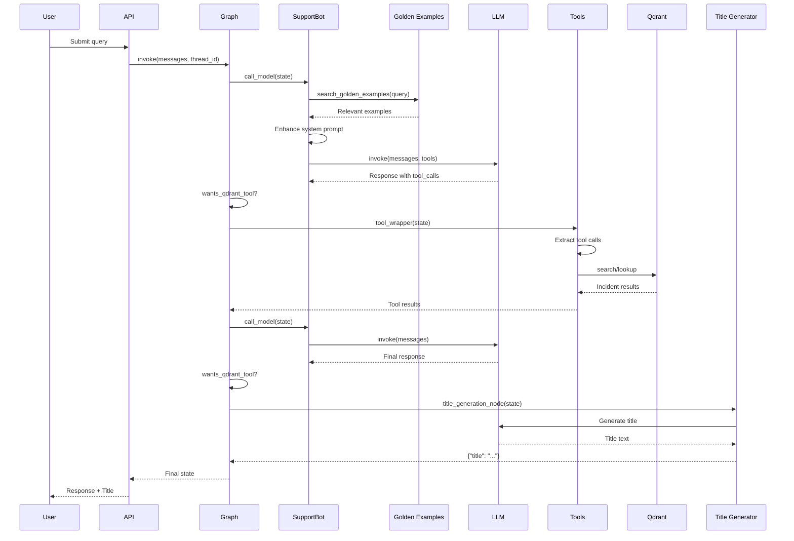

## Overview

This guide walks through the complete lifecycle of a query as it flows through the agent, from initial user input to final response generation.

## Complete Workflow Diagram



## Phase-by-Phase Breakdown

### Phase 1: Query Initiation

#### User Input

A user submits a query through the API:

```python
request = {
    "message": "How do I fix HTTP 403 errors in PayU?",
    "session_id": "session-abc123",
    "user_id": "user-456"
}
```

#### Graph Invocation

The API layer invokes the compiled graph:

```python
app = create_agent_graph()

result = app.invoke(
    {
        "messages": [("user", request["message"])],
        "session_id": request["session_id"],
        "user_id": request["user_id"],
        "langfuse_enabled": True,
        "generate_title": True
    },
    config={
        "configurable": {"thread_id": request["session_id"]}
    }
)
```

<Info>
The graph automatically loads any previous conversation history from the PostgreSQL checkpoint using the `thread_id`.
</Info>

### Phase 2: Support Bot Processing

**Node**: `support_bot` (`call_model` function)

#### Step 1: Extract User Query

```python
user_messages = [m for m in state["messages"] if m.type == 'human']
latest_query = user_messages[-1].content
# Result: "How do I fix HTTP 403 errors in PayU?"
```

#### Step 2: Search Golden Examples

The agent searches for similar past conversations:

```python
golden_examples = search_golden_examples_sync(
    query=latest_query,
    top_k=2,
    score_threshold=0.6
)
```

**Purpose**: Golden examples provide verified response patterns that improve answer quality.

**Example Golden Example**:
```
Query: "How to resolve PayU payment failures?"
Response: "Based on incident INC-2025-01-15-003, PayU payment failures..."
```

#### Step 3: Enhance System Prompt

If golden examples are found, inject them into the system message:

```python
enhanced_content = build_prompt_with_golden_examples(
    base_prompt=SYSTEM_MESSAGE_PROMPT.content,
    golden_examples=golden_examples
)
enhanced_system_prompt = SystemMessage(enhanced_content)
```

**Enhanced Prompt Structure**:
```
[Base System Prompt]

## Verified Knowledge
Direct Answer Available: Yes

[Golden Example 1]
Query: ...
Response: ...

[Golden Example 2]
...
```

#### Step 4: Bind Tools to LLM

```python
model_with_tools = llm.bind_tools(available_tools)
# Tools: lookup_incident_by_id, search_similar_incidents, 
#        get_incidents_by_application, get_recent_incidents
```

#### Step 5: Invoke LLM

```python
messages = [enhanced_system_prompt] + list(state["messages"])

response = model_with_tools.invoke(
    messages,
    config={"callbacks": callbacks, "run_name": "Support Bot LLM"}
)
```

**LLM Reasoning** (internal):
1. User is asking about HTTP 403 errors in PayU
2. This is a problem description without specific incident ID
3. Need to rewrite query: "HTTP 403 forbidden PayU"
4. Select tool: `search_similar_incidents`
5. Generate tool call

**Response** (`src/copilot/graph.py:260`):
```python
AIMessage(
    content="",
    tool_calls=[
        {
            "name": "search_similar_incidents",
            "args": {"query": "HTTP 403 forbidden PayU", "limit": 5},
            "id": "call_abc123"
        }
    ]
)
```

### Phase 3: Conditional Routing

**Function**: `wants_qdrant_tool` (`src/copilot/graph.py:286`)

```python
last_message = state["messages"][-1]

if last_message.tool_calls:
    writer({"status": "Analyzing your request... please hold on."})
    return "continue"  # → incident_tools node
```

**Decision**: LLM requested a tool call → Route to `incident_tools`

### Phase 4: Tool Execution

**Node**: `incident_tools` (`tool_wrapper` function)

#### Step 1: Extract Tool Call

The ToolNode extracts the tool call from the message:

```python
tool_name = "search_similar_incidents"
tool_args = {"query": "HTTP 403 forbidden PayU", "limit": 5}
```

#### Step 2: Execute Tool Function

**Function**: `search_similar_incidents` (`src/copilot/tools/incident_tools.py:141`)

```python
@tool
def search_similar_incidents(query: str, limit: int = 5) -> str:
    writer = get_safe_stream_writer()
    writer({"status": "Searching for Similar Incidents..."})
    
    retriever = _get_retriever()
    
    # Try SelfQueryRetriever first
    docs = retriever.invoke(input=query)
    
    # Fallback to vector search if needed
    if not docs:
        docs = vector_store.similarity_search(query=query, k=limit * 2)
    
    return format_incidents_response(docs)
```

#### Step 3: Qdrant Search

The tool queries the Qdrant vector database:

```python
# Semantic similarity search
results = vector_store.similarity_search(
    query="HTTP 403 forbidden PayU",
    k=10
)
```

**Qdrant Process**:
1. Embed query using embedding model
2. Search for similar vectors in `past_issues_v2` collection
3. Return top-k results with metadata

#### Step 4: Format Results

```python
def format_incidents_response(docs: List[Document]) -> str:
    # Deduplicate by incident_id
    # Format as structured text with metadata
    # Include: ID, title, description, root cause, resolution, etc.
```

**Example Output**:
```
## Incident INC-2025-01-20-005
**Title**: PayU HTTP 403 Authorization Failure
**Impacted Application**: PayU Core
**Root Cause**: API key rotation caused authentication failures
**Action Taken**: Updated API keys in all environments
**Status**: Resolved

## Incident INC-2025-01-18-012
...
```

#### Step 5: Return Tool Message

The tool node returns a `ToolMessage`:

```python
ToolMessage(
    content="[Formatted incident results]",
    tool_call_id="call_abc123"
)
```

**Graph Action**: Direct edge routes back to `support_bot` (`src/copilot/graph.py:449`)

### Phase 5: Response Generation

**Node**: `support_bot` (second invocation)

The LLM now has tool results in the conversation history:

```python
messages = [
    SystemMessage("You are an expert incident resolution assistant..."),
    HumanMessage("How do I fix HTTP 403 errors in PayU?"),
    AIMessage(tool_calls=[...]),
    ToolMessage("## Incident INC-2025-01-20-005\n...")
]
```

**LLM Reasoning**:
1. Tool returned 2 relevant incidents
2. Both relate to PayU HTTP 403 errors
3. Most recent: INC-2025-01-20-005 (API key rotation)
4. Generate response citing the incident

**Response**:
```python
AIMessage(
    content="""Based on incident INC-2025-01-20-005, HTTP 403 errors in PayU are 
    typically caused by API key authentication failures. The resolution involves:
    
    1. Verify API keys are correctly configured in all environments
    2. Check if API keys have been recently rotated
    3. Update configuration files with new keys
    4. Restart affected services
    
    The incident was resolved by updating API keys across all environments after 
    a scheduled key rotation.""",
    tool_calls=None
)
```

### Phase 6: Title Generation

**Conditional Edge Decision**:

```python
last_message = state["messages"][-1]

if not last_message.tool_calls:
    if not state.get("title") and state.get("generate_title", True):
        return "title_generation"  # → title_generation node
```

**Node**: `title_generation` (`title_generation_node` function)

#### Step 1: Create Conversation Transcript

```python
chat_text = "\n".join(
    f"{m.type.upper()}: {getattr(m, 'content', '')}"
    for m in state["messages"]
)
```

**Result**:
```
HUMAN: How do I fix HTTP 403 errors in PayU?
AI: Based on incident INC-2025-01-20-005, HTTP 403 errors...
```

#### Step 2: Generate Title

```python
prompt = SystemMessage(
    "Generate a concise, 2-4 word title..."
)

response = llm.invoke([prompt])
title_text = response.content.strip()  # "PayU HTTP 403 Fix"
```

#### Step 3: Stream Title

```python
writer = get_stream_writer()
writer({"title": title_text})
writer({"status": "Almost done, wrapping up the details"})

return {"title": title_text}
```

### Phase 7: Completion

The graph reaches the `END` state and returns the final state:

```python
{
    "messages": [
        HumanMessage("How do I fix HTTP 403 errors in PayU?"),
        AIMessage(tool_calls=[...]),
        ToolMessage("[incident results]"),
        AIMessage("Based on incident INC-2025-01-20-005...")
    ],
    "title": "PayU HTTP 403 Fix",
    "session_id": "session-abc123",
    "user_id": "user-456"
}
```

The state is automatically persisted to PostgreSQL via the checkpointer.

## Alternative Workflows

### Direct Incident ID Lookup

**User Query**: "Show me incident INC-2025-08-24-001"

**Workflow Changes**:

1. **Support Bot**: LLM recognizes specific incident ID
2. **Tool Selection**: Calls `lookup_incident_by_id` instead of similarity search
3. **Tool Execution**: Direct Qdrant filter by `metadata.incident_id`
4. **Response**: Returns complete incident details

**Tool Call**:
```python
{
    "name": "lookup_incident_by_id",
    "args": {"incident_id": "INC-2025-08-24-001"}
}
```

**Qdrant Query**:
```python
qdrant_filter = Filter(
    must=[
        FieldCondition(
            key="metadata.incident_id",
            match=MatchValue(value="INC-2025-08-24-001")
        )
    ]
)
```

### Application-Specific Search

**User Query**: "What incidents affected the Settlement & Reporting system?"

**Tool Call**:
```python
{
    "name": "get_incidents_by_application",
    "args": {"app_name": "Settlement & Reporting", "limit": 5}
}
```

**Process** (`src/copilot/tools/incident_tools.py:214`):

1. Filter by `metadata.impacted_application`
2. Deduplicate by incident_id
3. Fallback to semantic search if no exact matches

### Time-Based Search

**User Query**: "Show me incidents from the last 7 days"

**Tool Call**:
```python
{
    "name": "get_recent_incidents",
    "args": {"days": 7, "limit": 10}
}
```

**Process** (`src/copilot/tools/incident_tools.py:287`):

1. Calculate cutoff date: `datetime.now() - timedelta(days=7)`
2. Scroll through all incidents
3. Parse dates from incident IDs (format: `INC-YYYY-MM-DD-NNN`)
4. Filter and sort by date

### Multi-Turn Conversations

**Turn 1**:
```
User: "What caused incident INC-2025-08-24-001?"
Agent: [Looks up incident] "The root cause was..."
```

**Turn 2** (same thread_id):
```
User: "What was the resolution?"
Agent: [Uses memory, no tool call] "The resolution involved..."
```

**Key Difference**: The system prompt instructs the LLM to use memory for follow-up questions about already-retrieved incidents.

## Streaming Behavior

The agent supports streaming for real-time updates:

```python
for mode, chunk in app.stream(
    input={"messages": [("user", query)]},
    config={"configurable": {"thread_id": "thread-1"}},
    stream_mode=["messages", "custom"]
):
    if mode == "custom":
        # Status updates: {"status": "...", "title": "..."}
        print(chunk)
    elif mode == "messages":
        # Token-by-token LLM output
        if chunk.content:
            print(chunk.content, end="", flush=True)
```

### Stream Updates

**Custom Stream Events**:

1. `{"status": "Analyzing your request... please hold on."}` — Tool call detected
2. `{"status": "Searching for Similar Incidents..."}` — Tool executing
3. `{"status": "Found 2 relevant incidents..."}` — Tool completed
4. `{"status": "Generating title for the incident report..."}` — Title generation
5. `{"title": "PayU HTTP 403 Fix"}` — Title generated
6. `{"status": "Almost done, wrapping up the details"}` — Completion

## Error Handling

### Tool Execution Errors

All tools have try-except blocks:

```python
try:
    docs = retriever.invoke(input=query)
    return format_incidents_response(docs)
except Exception as e:
    logger.error(f"Error in search_similar_incidents: {e}")
    return (
        "An error occurred while searching for incidents. "
        "Please try rephrasing your query..."
    )
```

### LLM Fallbacks

If the primary retriever fails, tools fall back to simpler methods:

```python
try:
    docs = retriever.invoke(input=query)  # SelfQueryRetriever
except Exception:
    docs = vector_store.similarity_search(query=query)  # Fallback
```

### Empty Results

```python
if not docs:
    writer({"status": "No similar incidents found"})
    return "No incidents found matching your query."
```

The LLM receives this message and informs the user appropriately.

## Performance Optimizations

### LLM Caching

**Benefit**: Avoids recreating LLM instances on every request

```python
if _cached_llm_config_hash == config_hash and _cached_llm is not None:
    return  # Use cached LLM
```

### Parallel Title Generation

For API endpoints that need immediate responses, title generation can run in parallel:

```python
from concurrent.futures import ThreadPoolExecutor

with ThreadPoolExecutor() as executor:
    # Start title generation in background
    title_future = executor.submit(
        generate_title_from_query,
        query=user_query,
        session_id=session_id
    )
    
    # Stream main response
    for chunk in app.stream(...):
        yield chunk
    
    # Get title when ready
    title = title_future.result()
```

### Golden Example Caching

Golden examples are searched on every query, but results are typically fast due to vector search optimization.

## Next Steps

<CardGroup cols={2}>
  <Card title="Tools Reference" icon="wrench" href="/agent/tools">
    Detailed documentation for each tool function
  </Card>
  <Card title="API Integration" icon="plug" href="/agent/api">
    Learn how to integrate the agent into your application
  </Card>
</CardGroup>