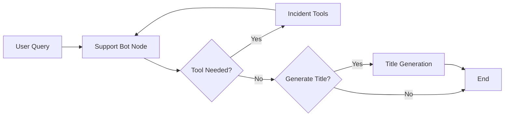

# AI Copilot

The AI Copilot is the brain of Support Bot - an intelligent agent powered by LangGraph that helps you resolve incidents faster by searching historical data, analyzing patterns, and providing contextual recommendations.

## How It Works

The AI Copilot uses a sophisticated agent graph that processes your queries through multiple steps:

<Steps>
  <Step title="Query Understanding">
    The copilot analyzes your question, extracts search intent, and rewrites conversational queries into search-optimized terms.
    
    For example:
    - "hey how to solve the issue with loan emi?" → `"Loan EMI issue"`
    - "what happened with Swift transfer delays?" → `"Swift transfer delays"`
  </Step>

  <Step title="Tool Selection">
    Based on your query, the agent automatically selects the right search tool:
    
    - `lookup_incident_by_id`: When you mention a specific incident ID
    - `search_similar_incidents`: When you describe a problem or error
    - `get_incidents_by_application`: When asking about a specific app/system
    - `get_recent_incidents`: When asking about recent timeframes
  </Step>

  <Step title="Knowledge Retrieval">
    The agent searches your knowledge base using vector similarity search to find the most relevant historical incidents and solutions.
  </Step>

  <Step title="Response Generation">
    The LLM synthesizes information from retrieved incidents, cites sources, and provides actionable recommendations in real-time.
  </Step>
</Steps>

## Key Features

### Conversational Memory

The copilot maintains context across your entire conversation using PostgreSQL checkpointing:

```python
# Each conversation has a unique thread ID
thread_config = {"configurable": {"thread_id": "your-chat-id"}}
```

This means you can ask follow-up questions naturally:

<CodeGroup>
```text First Question
You: "Show me incidents related to payment gateway errors"
Bot: "Found 5 incidents... [detailed response with INC-2025-001]"
```

```text Follow-up
You: "What was the root cause?"
Bot: "Based on incident INC-2025-001, the root cause was..."
```
</CodeGroup>

### Golden Examples

The copilot learns from verified incident resolutions to improve its recommendations:

```python
# Searches for similar golden examples
golden_examples = search_golden_examples_sync(
    query=latest_query,
    top_k=2,
    score_threshold=0.6
)

# Enhances the system prompt with examples
enhanced_content = build_prompt_with_golden_examples(
    base_prompt=SYSTEM_MESSAGE_PROMPT.content,
    golden_examples=golden_examples
)
```

This helps the AI provide more accurate, proven solutions based on what worked before.

### Smart Query Rewriting

The copilot automatically cleans and optimizes your queries for better search results:

<CodeGroup>
```text Before
"can you tell me about payment gateway errors?"
```

```text After
"payment gateway errors"
```
</CodeGroup>

This removes conversational fluff and extracts the core search intent.

## Multi-LLM Support

You can use any LLM provider with the copilot:

<CardGroup cols={2}>
  <Card title="Anthropic Claude" icon="robot">
    Claude 3.5 Sonnet for powerful reasoning and analysis
  </Card>
  
  <Card title="OpenAI GPT" icon="brain">
    GPT-4 for general-purpose assistance
  </Card>
  
  <Card title="Google Gemini" icon="sparkles">
    Gemini Pro for cost-effective processing
  </Card>
  
  <Card title="Ollama (Local)" icon="server">
    Run models locally for privacy and control
  </Card>
</CardGroup>

The copilot automatically adapts to your configured provider:

```python
set_llm_from_config(
    provider_type="anthropic",  # or "openai", "google", "custom"
    model_id="claude-3-5-sonnet-20241022",
    api_key="your-api-key",
    temperature=0.7
)
```

## Agent Architecture

The copilot uses a LangGraph state machine with three main nodes:



### State Management

The agent maintains state across interactions:

```python
class AgentState(TypedDict):
    messages: Annotated[Sequence[BaseMessage], add_messages]
    title: Optional[str]
    session_id: Optional[str]
    user_id: Optional[str]
    langfuse_enabled: Optional[bool]
    generate_title: Optional[bool]
```

This allows the copilot to:
- Track conversation history
- Remember user context
- Generate conversation titles
- Manage tool execution

## Using the Copilot

### In the Web Interface

The copilot powers the chat interface automatically. Just type your question:

```text
"Show me recent payment failures"
"What caused incident INC-2025-08-24-001?"
"Find Swift transfer issues from last week"
```

### Via the API

You can integrate the copilot into your own applications:

```python
from src.copilot.graph import create_agent_graph

# Create the agent
agent_graph = create_agent_graph()

# Invoke with your query
result = agent_graph.invoke(
    input={"messages": [("user", "Find payment gateway errors")]},
    config={"configurable": {"thread_id": "session-123"}}
)

# Get the response
answer = result["messages"][-1].content
```

### With Streaming

For real-time responses as the agent thinks:

```python
for mode, chunk in agent_graph.stream(
    input=inputs,
    config=thread_config,
    stream_mode=["custom", "messages"]
):
    if mode == "messages":
        token_chunk, metadata = chunk
        print(token_chunk.content, end="", flush=True)
```

## Best Practices

<AccordionGroup>
  <Accordion title="Be Specific with Incident IDs">
    When referencing specific incidents, include the full ID:
    
    ✅ "Tell me about incident INC-2025-08-24-001"
    
    ❌ "Tell me about that payment incident"
  </Accordion>

  <Accordion title="Use Clear Search Terms">
    The copilot works best with clear, specific terminology:
    
    ✅ "HTTP 403 forbidden errors in PayU integration"
    
    ❌ "that thing that's not working"
  </Accordion>

  <Accordion title="Ask Follow-up Questions">
    Take advantage of conversation memory:
    
    1. "Show me database timeout incidents"
    2. "What was the root cause of the first one?"
    3. "Has this happened before?"
  </Accordion>

  <Accordion title="Leverage Time-based Queries">
    The copilot understands temporal context:
    
    - "Recent incidents"
    - "Last week's failures"
    - "Issues from yesterday"
  </Accordion>
</AccordionGroup>

## Configuration Options

### Temperature Control

Adjust the LLM's creativity vs. consistency:

```python
DEFAULT_LLM_TEMPERATURE = 0.7  # Range: 0.0 (deterministic) to 1.0 (creative)
```

- **Lower (0.0-0.3)**: More consistent, factual responses
- **Medium (0.4-0.7)**: Balanced creativity and accuracy
- **Higher (0.8-1.0)**: More creative, varied responses

### Tracing with Langfuse

Enable observability to debug and monitor the copilot:

```python
inputs = {
    "messages": [("user", query)],
    "langfuse_enabled": True,  # Enable tracing
    "session_id": session_id,
    "user_id": user_id
}
```

This tracks:
- LLM invocations
- Tool executions
- Token usage
- Response quality

<Note>
  Langfuse tracking is opt-in by default for privacy. Users must explicitly enable it.
</Note>

## Troubleshooting

### Copilot Not Finding Incidents

If the copilot isn't finding relevant incidents:

1. **Check your knowledge base**: Ensure incidents are ingested into Qdrant
2. **Verify embeddings**: The system uses `all-MiniLM-L6-v2` for semantic search
3. **Review query formatting**: Make sure queries are clear and specific

### Slow Response Times

If responses are taking too long:

1. **Check LLM provider**: Some models are faster than others
2. **Use streaming mode**: Get partial responses while processing
3. **Optimize tool calls**: Reduce the number of concurrent searches

### Context Not Maintained

If the copilot forgets previous messages:

1. **Verify thread_id**: Ensure the same thread ID is used across requests
2. **Check PostgreSQL**: The checkpointer requires a working database connection
3. **Review session state**: Make sure `session_id` is passed correctly

## Next Steps

<CardGroup cols={2}>
  <Card title="Knowledge Base" icon="database" href="/features/knowledge-base">
    Learn how to populate and manage your incident knowledge base
  </Card>
  
  <Card title="LangGraph Architecture" icon="sitemap" href="/agent/architecture">
    Deep dive into the agent's internal workflow
  </Card>
  
  <Card title="LLM Providers" icon="brain" href="/admin/llm-providers">
    Configure and manage different AI model providers
  </Card>
  
  <Card title="API Reference" icon="code" href="/api/chat/conversations">
    Integrate the copilot into your applications
  </Card>
</CardGroup>